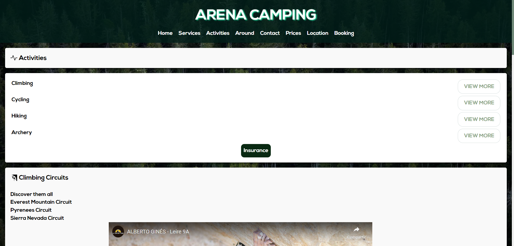
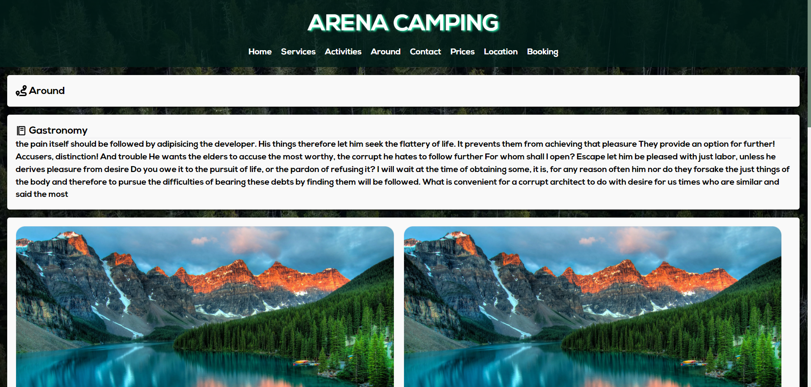
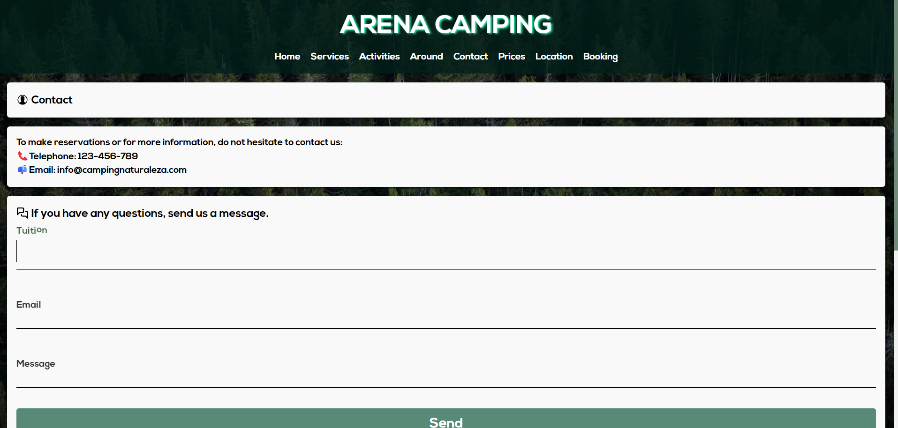
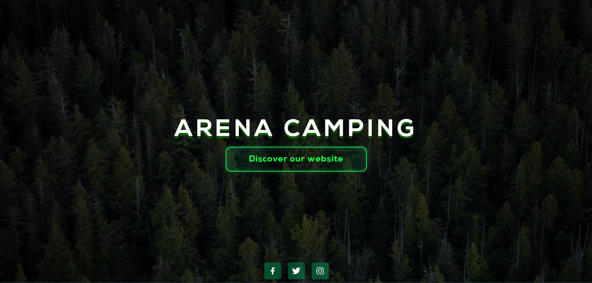
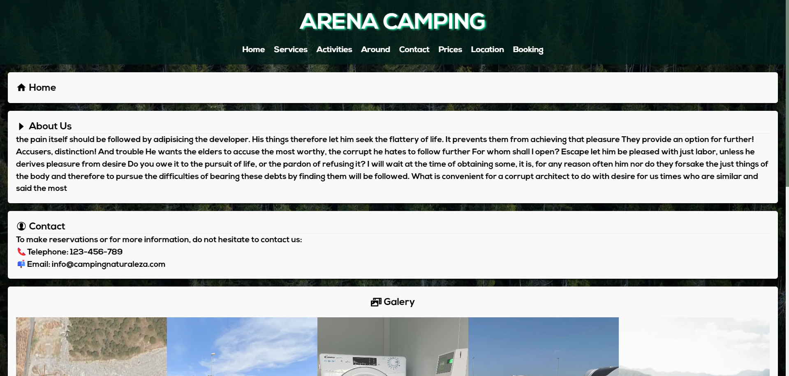
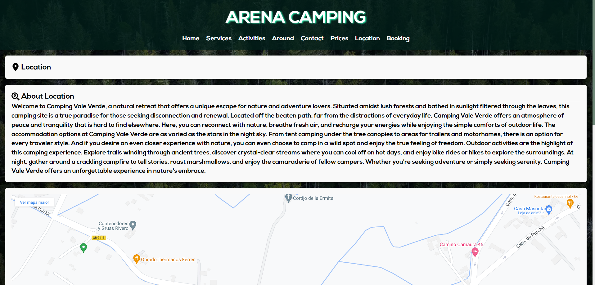
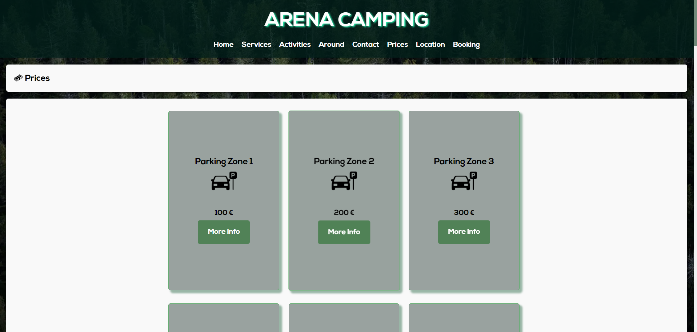
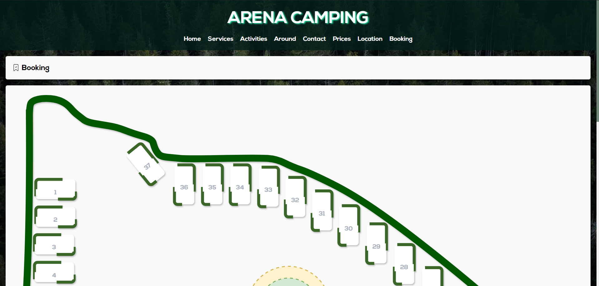

# <center><h1>Arena-app</h1></center>


Este proyecto es una aplicación web desarrollada utilizando React y Node.js.

## Descripción

Esta aplicación web es el resultado del trabajo colaborativo de dos profesionales durante su período de prácticas en la empresa Arena Gaming. 

## Instalación

1. Clona este repositorio.
2. Instala las dependencias utilizando npm:

   ```bash
   npm install
   ```

## Uso

Para ejecutar la aplicación, puedes utilizar el siguiente comando:

```bash
npm start
```

Esto iniciará el servidor y podrás acceder a la aplicación desde tu navegador.

## Capturas de pantalla | Screenshots

A continuación, se muestran algunas capturas de pantalla de la aplicación:

### Actividades


### Around


### Contacto


### Footer


### Home


### Inicio


### Localización


### Precios


### Reserva


### Servicios


## Contribución

Si quieres contribuir a este proyecto, ¡serás bienvenido! Puedes abrir un issue o enviar un pull request.

## Licencia

[MispeLicense]
